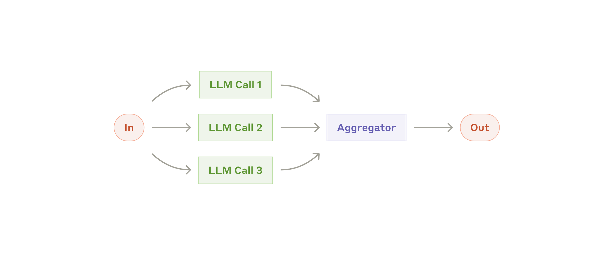

# Building Effective Agents：从简单模式到可控 Agent

资料来源：[Anthropic Engineering: Building effective agents](https://www.anthropic.com/engineering/building-effective-agents)

## 阅读目标

关注三个问题：

1. Anthropic 如何区分 workflow、agent 和更宽泛的 agentic system。
2. 常见 agentic workflow 分别适合什么任务，代价和边界是什么。
3. 生产系统中如何控制 agent 的复杂度、可观测性、工具接口和人类监督。

核心结论是：有效的 Agent 系统不等于更复杂的框架或更大的自主循环。应先用最简单的 LLM 调用、检索、示例和工具解决问题；只有当任务确实需要多步分解、动态决策或环境反馈时，再引入 workflow 或 autonomous agent。

## 名词解释

| 名词 | 解释 | 简单例子 |
|---|---|---|
| Agentic system | 广义上使用 LLM、工具、记忆、检索和多步控制来完成任务的系统。 | 客服助手先判断问题类型，再查询订单并决定是否创建退款申请。 |
| Workflow | LLM 和工具沿预定义代码路径执行的系统。 | 先生成大纲，再检查大纲，最后根据大纲写正文。 |
| Agent | LLM 动态决定过程、工具使用和下一步动作的系统。 | 编码 agent 根据测试失败结果自行决定查文件、改代码、再跑测试。 |
| Augmented LLM | 带有检索、工具和记忆能力的 LLM，是更复杂 agentic system 的基础构件。 | 模型可以搜索知识库、调用订单查询工具，并记住用户偏好。 |
| Prompt chaining | 把任务拆成固定步骤，每一步 LLM 处理上一步输出。 | 先写营销文案，再翻译，再检查语气。 |
| Routing | 先分类输入，再路由到专门流程、prompt、模型或工具。 | 普通咨询走 FAQ，退款请求走订单和退款流程。 |
| Parallelization | 多个 LLM 调用并行处理子任务或给出多路判断，再由代码聚合。 | 一个模型生成答案，另一个模型同时检查安全风险。 |
| Orchestrator-workers | 中央 LLM 根据任务动态拆分子任务，分派给多个 worker，再汇总结果。 | 编码任务中 orchestrator 决定哪些文件需要分别修改。 |
| Evaluator-optimizer | 一个 LLM 生成结果，另一个 LLM 根据明确标准评价并反馈，形成迭代循环。 | 翻译模型给初稿，评价模型指出语义遗漏，再生成修订版。 |
| ACI | Agent-computer interface，agent 与计算机、工具、文件和外部系统交互的接口设计。 | 文件编辑工具要求绝对路径，降低模型在目录切换后误改文件的概率。 |

## 1. 背景：先问是否真的需要 Agent

原文的工程立场很明确：LLM 应用不应默认上 agent。很多场景中，一个带检索、示例和结构化输出的单次 LLM 调用就足够。

Agentic system 通常会用更多模型调用、更多工具调用和更长控制链换取更好的任务完成能力。代价包括：

| 代价 | 具体表现 | 设计含义 |
|---|---|---|
| 延迟 | 多轮 LLM 调用、工具调用和检查会拉长响应时间。 | 面向实时交互时要限制轮数和并行成本。 |
| 成本 | 多模型、多工具、多候选输出都会增加 token 和基础设施消耗。 | 需要用 eval 证明复杂度带来的收益。 |
| 可调试性 | 中间步骤越多，失败来源越分散。 | 必须记录 prompt、工具输入输出和路由决策。 |
| 错误累积 | 每一步判断都可能把后续步骤带偏。 | 要设置 gate、停止条件、人类审批和回滚机制。 |

因此可以按以下顺序选型：

| 任务特征 | 优先方案 |
|---|---|
| 输入清晰、输出一次可生成 | 单次 LLM 调用，加检索或 few-shot 示例。 |
| 可以拆成固定步骤 | Workflow，例如 prompt chaining。 |
| 有明确类别，类别对应不同处理方式 | Routing。 |
| 子任务独立，或需要多路判断提高置信度 | Parallelization。 |
| 子任务数量和内容难以预先确定 | Orchestrator-workers。 |
| 结果可被明确评价，并且迭代能提升质量 | Evaluator-optimizer。 |
| 步骤数量不可预测，需要模型根据环境反馈连续决策 | Agent。 |

## 2. Workflow 与 Agent 的边界

原文把 workflow 和 agent 都放在 agentic system 之下，但强调二者的控制权不同。

| 维度 | Workflow | Agent |
|---|---|---|
| 控制流来源 | 代码预定义路径。 | LLM 动态决定下一步。 |
| 可预测性 | 高，适合稳定流程。 | 较低，适合开放任务。 |
| 适用任务 | 分类、固定流水线、多阶段生成、评估迭代。 | 编码、复杂检索、长任务执行、需要持续环境反馈的任务。 |
| 主要风险 | 流程过度僵化，覆盖不了输入变化。 | 成本更高，错误可能跨多轮累积。 |
| 关键控制点 | gate、schema、路由规则、聚合逻辑。 | 工具设计、环境反馈、停止条件、沙箱、人类检查点。 |

这个区分有助于避免两个误区。

第一，不要把所有多步 LLM 系统都叫 agent。只要步骤和路径主要由代码控制，更准确的说法是 workflow。

第二，不要为了“智能”而放弃确定性控制。能够用代码固定下来的检查、路由、聚合和审批，应优先留在代码里。

## 3. 基础构件：Augmented LLM

Augmented LLM 是所有模式的基础：模型不仅生成文本，还能使用检索、工具和记忆。

这一步的重点不是把所有能力都塞给模型，而是让这些能力变成清晰、低歧义、可测试的接口：

| 能力 | 作用 | 工程关注点 |
|---|---|---|
| Retrieval | 把外部知识引入当前上下文。 | 检索结果是否相关、是否可引用、是否过长。 |
| Tools | 让模型查询环境或触发动作。 | 工具命名、参数、权限、错误恢复和审计。 |
| Memory | 保留跨会话或长期任务状态。 | 记忆写入条件、过期策略、隐私和冲突处理。 |

原文提到 Model Context Protocol 可以作为工具和外部能力集成的一种方式。对本仓库的工程视角来说，更重要的是：无论底层协议是什么，agent 看到的接口都应像面向模型的产品界面，而不是后端 API 的裸露集合。

## 4. Workflow 模式一：Prompt chaining

Prompt chaining 把任务拆成固定序列，每一步只解决一个更小的问题。中间可以插入代码检查，也就是图中的 gate。

适用条件：

| 条件 | 说明 |
|---|---|
| 任务能清晰分解 | 每一步输入输出边界明确。 |
| 分步能提高质量 | 单次调用难以同时兼顾所有要求。 |
| 可以接受额外延迟 | 多次 LLM 调用换取更高准确率。 |

典型例子是先生成文档大纲，检查大纲是否满足要求，再基于大纲写正文。这里的关键不是“多调用几次模型”，而是让每次调用的认知负担更小，并在关键节点用确定性检查阻止错误继续传播。

工程落地时要注意：

- 每一步输出都应结构化，至少要能被下一步稳定消费。
- gate 要检查真正影响后续质量的条件，不要只检查格式。
- 如果中间结果失败，应返回到明确步骤重试，而不是把完整错误历史交给后续步骤自行猜测。

## 5. Workflow 模式二：Routing

Routing 先判断输入属于哪一类，再交给更专门的流程、prompt、模型或工具集。

适用条件：

| 条件 | 说明 |
|---|---|
| 输入类别边界相对清晰 | 分类器或 LLM 能稳定识别类别。 |
| 不同类别需要不同处理 | 一个通用 prompt 很难同时优化所有路径。 |
| 错误路由可被监控 | 能统计误分、漏分和兜底路径。 |

客服系统是典型例子：普通问题、退款、技术支持可以进入不同流程。模型路由也常见：简单问题给更小、更便宜的模型，复杂问题给更强模型。

Routing 的主要风险是分类错误。工程上需要：

- 保留 `unknown` 或 `needs_human_review` 兜底类。
- 对高风险类别设置更严格阈值。
- 记录路由依据，方便回放和调优。
- 避免类别设计过细，导致模型在相似类别之间摇摆。

## 6. Workflow 模式三：Parallelization

Parallelization 让多个 LLM 调用并行执行，再由代码聚合结果。原文区分了两种形态：

| 形态 | 说明 | 例子 |
|---|---|---|
| Sectioning | 不同子任务并行处理。 | 一个模型回答用户问题，另一个模型检查安全风险。 |
| Voting | 同一任务多次生成或多角度判断。 | 多个代码审查 prompt 分别检查不同漏洞类型。 |

适用条件：

- 子任务之间依赖弱，可以并行。
- 需要多个视角提高置信度。
- 聚合逻辑能够明确表达，例如投票、阈值、分项打分或合并报告。

并行不是免费提升质量。它会增加成本，也可能制造冲突输出。生产中要把聚合规则写清楚：什么情况通过，什么情况拒绝，什么情况升级给人类。

## 7. Workflow 模式四：Orchestrator-workers

Orchestrator-workers 中，中央 LLM 根据输入动态拆解任务，分派给多个 worker，再合成结果。

它和 parallelization 的外形相似，但区别在于：parallelization 的子任务通常是预定义的，orchestrator-workers 的子任务由 orchestrator 在运行时决定。

适用条件：

| 条件 | 说明 |
|---|---|
| 子任务数量不可预知 | 例如编码任务中涉及哪些文件取决于具体需求。 |
| 子任务类型会变化 | 例如搜索任务要根据已发现的信息继续扩展来源。 |
| 汇总需要全局判断 | 最终结果不是简单拼接，而要由 orchestrator 统一取舍。 |

编码产品和复杂搜索是典型场景。风险在于 orchestrator 可能拆错任务、漏掉关键子问题，或生成过多无效 worker。可行的控制点包括：

- 限制 worker 数量和总 token 预算。
- 要求 orchestrator 输出任务拆分计划，便于 trace。
- worker 输出使用统一 schema，降低汇总成本。
- 对最终合成结果做独立检查或测试。

## 8. Workflow 模式五：Evaluator-optimizer

Evaluator-optimizer 用一个 LLM 生成结果，用另一个 LLM 按标准评价并反馈，循环改进。

适用条件：

| 条件 | 说明 |
|---|---|
| 评价标准清楚 | 能说明什么是更好的结果。 |
| 反馈能带来改进 | 人类给反馈时结果也会明显变好。 |
| 迭代收益可度量 | 能通过人工评审、自动指标或 eval 证明提升。 |

文学翻译、复杂调研、长文改写比较适合这种模式。它不适合没有明确评价标准的任务，否则 evaluator 可能只是在生成另一种主观意见。

工程上要设置：

- 最大迭代次数。
- 每轮评价标准和通过条件。
- 生成器与评价器的输入边界，避免评价器看到不必要噪声。
- 对最终结果的外部验收方式。

## 9. Autonomous Agent：动态控制流与环境反馈

Agent 适合开放任务：步骤数量无法预先确定，模型需要根据环境反馈持续决定下一步。它通常从用户指令或交互澄清开始，随后进入“计划 -> 工具调用 -> 观察结果 -> 调整计划”的循环。

关键条件是 agent 必须持续拿到 ground truth。工具返回、代码执行结果、测试输出、系统状态和人类反馈，都是 agent 判断进展的依据。

编码 agent 是典型例子：它可以读文件、改文件、运行测试、根据失败结果继续修改。软件任务天然适合 agent 的原因包括：

- 代码仓库提供结构化环境。
- 测试能给出相对客观的反馈。
- diff 和提交便于审查。
- 成功标准可以通过编译、测试和人工 review 组合验证。

但 autonomous agent 的代价也最高：

| 风险 | 控制方式 |
|---|---|
| 长循环导致成本失控 | 设置最大轮数、预算和停止条件。 |
| 错误跨多轮放大 | 每轮记录工具输入输出，关键动作前检查。 |
| 工具副作用不可逆 | 在沙箱执行，高风险动作需要审批。 |
| 模型误解环境状态 | 用工具结果和测试输出提供真实反馈。 |
| 用户难以信任过程 | 显式展示计划、关键决策和中间结果。 |

## 10. ACI：像设计 HCI 一样设计工具接口

原文在 Appendix 2 中强调：工具定义和格式同样需要 prompt engineering。模型不是普通程序调用者，它会受名称、参数、格式、示例和错误信息影响。

工具接口设计可以遵循几个原则：

| 维度 | 检查项 | 期望状态 |
|---|---|---|
| 格式自然度 | 输出格式是否接近模型常见文本形态。 | 少让模型处理复杂转义、行号计数或不自然嵌套。 |
| 参数清晰度 | 参数名是否说明业务含义。 | `absolute_file_path` 比 `path` 更能约束行为。 |
| 示例 | 是否给出典型用法和边界条件。 | 模型知道什么时候该用、什么时候不该用。 |
| 防错设计 | 参数和工具行为是否减少误用空间。 | 文件工具要求绝对路径，避免工作目录变化导致误改。 |
| 错误恢复 | 错误是否告诉模型如何修正。 | 返回缺失字段、合法枚举和是否可重试。 |

这与本仓库已有的 [Writing Effective Tools for Agents：Agent 工具设计原则](../writing-tools-for-agents/writing-tools-for-agents.md) 可以合并理解：工具不是 API endpoint 的简单包装，而是 agent 的操作界面。接口越清楚，agent 越不需要靠猜测补足语义。

## 11. 与现有文档的关系

| 文档 | 关注点 | 与本文档的关系 |
|---|---|---|
| [12-Factor Agents 设计原则](../12-factor-agents/12-factor-agents-principles.md) | Agent loop、状态、控制流、暂停恢复、人类介入。 | 解释生产 agent 应如何被软件工程约束。 |
| [ReAct 框架：从推理行动循环到可控 Agent](../react-framework/react-framework.md) | Reasoning + Acting 的基本循环。 | 是 autonomous agent 中“观察环境并决定下一步”的基础模式之一。 |
| [Tool Card 模板](../react-framework/tool-card-template.md) | 单个工具说明模板。 | 可用于落实本文档中的 ACI 和工具文档要求。 |
| [Writing Effective Tools for Agents](../writing-tools-for-agents/writing-tools-for-agents.md) | 工具粒度、命名、返回上下文和 eval。 | 深化本文档中工具接口设计部分。 |
| [Context Engineering 2.0](../context-engineering-2.0-pdf/context_engineering_2_cn_notes.md) | 上下文采集、管理和使用。 | 为 augmented LLM、workflow 中的检索、记忆和上下文组织提供背景。 |

本文档更像一张模式选择图：在具体实现前，先判断是否需要单次调用、workflow 还是 agent。

## 12. 工程落地检查表

| 维度 | 检查项 | 期望状态 |
|---|---|---|
| 复杂度选择 | 是否先验证单次 LLM 调用、检索和示例是否足够。 | 只有收益明确时才引入多步 workflow 或 agent。 |
| 模式匹配 | 任务特征是否匹配所选模式。 | 固定步骤用 workflow，开放步骤才用 agent。 |
| 可观测性 | 是否记录每次 prompt、路由、工具调用、返回和最终决策。 | 失败后能回放和定位。 |
| Eval | 是否有真实任务集验证复杂度收益。 | 不凭主观感觉增加 agent 层。 |
| Gate | 中间步骤是否有结构化检查。 | 错误不会无约束传递到后续步骤。 |
| 工具接口 | 工具是否有清晰命名、参数、示例、错误和边界。 | 模型容易正确调用，失败后知道如何恢复。 |
| 成本控制 | 是否限制轮数、token、工具调用次数和并发。 | agent 不会无限循环或成本失控。 |
| 安全边界 | 高风险操作是否在沙箱或审批后执行。 | 模型输出不直接等于不可逆副作用。 |
| 人类监督 | 是否在不确定、高风险或阻塞时回到人类。 | 人类介入是流程的一部分，而不是事后补救。 |

## 关键结论

1. Agentic system 的第一原则不是自主性，而是任务收益与复杂度匹配。
2. Workflow 适合代码路径可预定义的任务，agent 适合步骤数量和路径无法预先确定的开放任务。
3. Augmented LLM 是基础构件，检索、工具和记忆应以清晰接口提供给模型。
4. Prompt chaining、routing、parallelization、orchestrator-workers、evaluator-optimizer 分别解决不同多步任务，不应混用成一个大而全框架。
5. Autonomous agent 必须依赖环境 ground truth、停止条件、沙箱、trace 和人类检查点。
6. ACI 与 HCI 一样重要。工具名称、参数、格式和错误信息会直接影响 agent 的可靠性。
