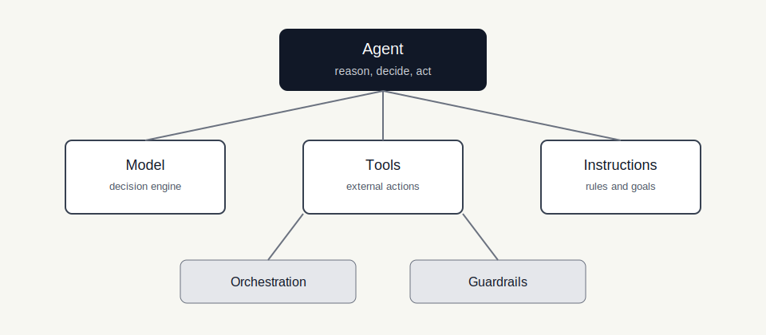
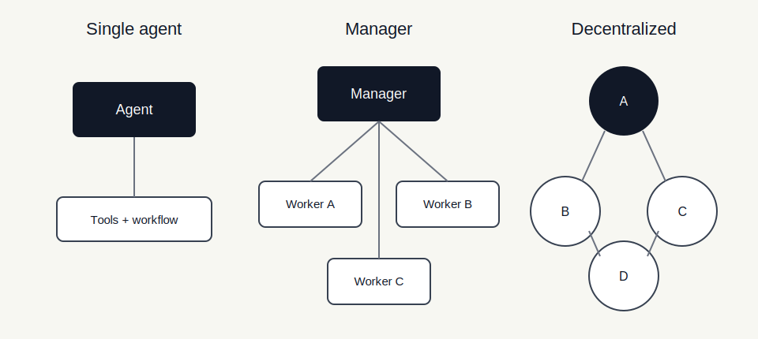
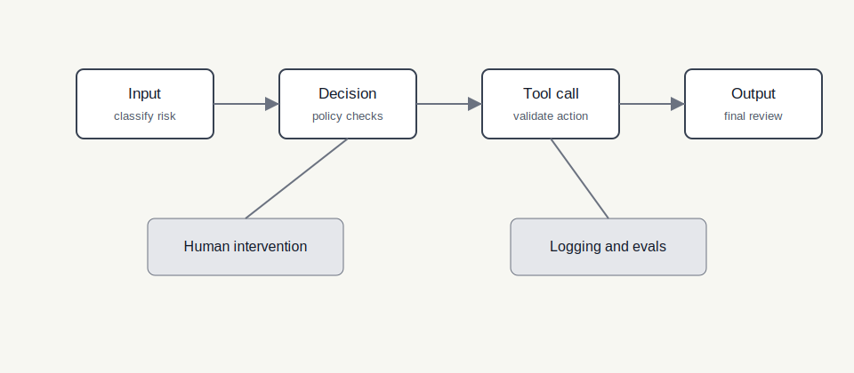

# OpenAI 实用指南：构建 AI Agents

资料来源：[OpenAI: A practical guide to building agents](https://openai.com/business/guides-and-resources/a-practical-guide-to-building-ai-agents/)

## 阅读目标

关注三个问题：

1. OpenAI 如何定义 agent，以及它和传统 automation 的差异。
2. 构建 agent 时，model、tools、instructions、orchestration、guardrails 分别承担什么职责。
3. 在企业场景中如何判断是否值得引入 agent，并把它逐步推向生产。

核心结论是：agent 适合处理传统规则系统难以覆盖的开放任务，例如复杂决策、难以维护的规则链和非结构化数据处理。生产落地时，应先从单 agent 开始，围绕明确任务配置模型、工具和指令，再通过 guardrails、human intervention、日志和 eval 控制风险。

## 名词解释

| 名词 | 解释 | 简单例子 |
|---|---|---|
| Agent | 能代表用户或流程独立完成任务的软件系统，通常具备推理、决策、工具使用和多步执行能力。 | 客服 agent 查询订单、判断是否符合退款条件，并创建退款申请。 |
| Automation | 按固定规则或流程执行任务的自动化系统。 | 如果订单超过 7 天未发货，就自动发送提醒邮件。 |
| Model | Agent 的决策核心，负责理解输入、推理、选择动作和生成响应。 | 判断用户问题是退款、物流还是账户问题。 |
| Tool | Agent 可调用的外部能力，包括查询数据、执行动作或调用其他系统。 | 查询 CRM、搜索知识库、创建工单、更新订单状态。 |
| Instructions | 给 agent 的任务说明、行为边界、流程规则和升级条件。 | “退款金额超过 100 美元时必须请求人工确认”。 |
| Orchestration | 控制 agent 如何分解任务、调用工具、切换 agent 和结束流程的机制。 | 一个 manager agent 把任务分派给订单、账单和技术支持 agent。 |
| Handoff | 一个 agent 将任务或上下文交给另一个 agent 继续处理。 | 初级客服 agent 将复杂账单问题交给账单 specialist agent。 |
| Guardrails | 在输入、工具调用、输出和流程节点上设置的安全与质量约束。 | 拦截无关请求、过滤 PII、校验工具参数、要求人工审批。 |
| Human intervention | 在不确定、高风险或敏感场景中让人类参与判断。 | Agent 准备给客户退款前，请运营人员确认。 |
| Eval | 用任务集、指标和轨迹评估 agent 是否稳定完成目标。 | 用历史客服 case 测试 agent 是否正确分类、查单和升级。 |

## 1. 背景：Agent 不是所有自动化的默认答案

原文把 agent 放在企业自动化语境中讨论。它不是把每个流程都交给模型，而是在传统 automation 难以覆盖时，引入能理解上下文、使用工具、做多步判断的软件组件。

适合 agent 的信号通常包括：

| 信号 | 说明 | 例子 |
|---|---|---|
| 复杂决策 | 任务需要综合多条信息，而不是简单 if/else。 | 判断客户是否应退款，需要看订单、物流、历史投诉和政策。 |
| 规则难维护 | 规则分支持续膨胀，维护成本越来越高。 | 每新增一种异常订单状态，都要改多个流程节点。 |
| 非结构化数据 | 输入来自邮件、聊天、文档、网页或日志。 | 从供应商邮件中抽取异常原因并决定下一步。 |
| 多系统操作 | 任务需要跨多个工具查询和写入。 | 先查知识库，再查 CRM，最后创建工单。 |
| 需要动态恢复 | 执行过程中可能失败，需要根据反馈调整。 | 工具返回缺少字段后，agent 重新查询或请求用户补充。 |

不适合 agent 的场景也同样明确：

| 场景 | 更合适的方案 |
|---|---|
| 流程完全固定，输入输出结构稳定。 | 普通确定性代码或工作流引擎。 |
| 错误成本极高，且无法设置人工审批或回滚。 | 强规则系统加人工处理。 |
| 任务只需要一次分类或一次生成。 | 单次 LLM 调用或传统模型。 |
| 工具权限和数据边界尚未定义。 | 先完成权限、审计和安全设计。 |

也就是说，agent 的价值不在“自动执行”，而在能处理传统自动化难以穷举的上下文变化。

## 2. Agent 的基础构件

OpenAI 的指南把构建 agent 的核心要素拆成几个层次：model、tools、instructions，再加上 orchestration 和 guardrails。

| 构件 | 作用 | 设计重点 |
|---|---|---|
| Model | 理解任务、推理、选择动作。 | 根据任务复杂度、延迟、成本和可靠性选择模型。 |
| Tools | 让 agent 获取信息或执行动作。 | 工具应有清晰 schema、权限、错误恢复和审计。 |
| Instructions | 约束 agent 的行为方式。 | 写清目标、步骤、边界、异常和升级条件。 |
| Orchestration | 控制多步流程和 agent 协作。 | 先单 agent，复杂后再拆分多 agent。 |
| Guardrails | 限制风险和质量问题。 | 在输入、工具、输出和人工介入节点设置检查。 |

这个拆分和本仓库已有的 12-Factor Agents 思路一致：LLM 不直接等于业务系统。模型负责判断和生成意图，确定性系统负责执行、校验、记录和控制副作用。

## 3. Model：先建立质量基线，再优化成本

模型选择不应只看价格或速度，而要从任务要求出发。原文建议根据任务复杂度、延迟、成本和可靠性做取舍。

| 维度 | 关注问题 | 工程做法 |
|---|---|---|
| 任务复杂度 | 是否需要多步推理、工具选择和错误恢复。 | 先用能力更强的模型建立质量上限。 |
| 延迟 | 用户是否需要实时响应。 | 对简单路径使用更快模型或 routing。 |
| 成本 | 单次任务是否会触发多轮调用。 | 统计完整任务成本，而不是只看单次模型价格。 |
| 稳定性 | 输出是否影响真实业务动作。 | 用 eval、trace 和人工抽检验证。 |

一个常见落地路径是：先用更强模型跑通任务和评测集，确认 agent 真的能完成目标；再通过任务拆分、模型路由、缓存、工具优化和上下文压缩降低成本。

不要一开始就用最便宜的模型做复杂 agent。否则很容易把模型能力不足误判为工具、prompt 或框架问题。

## 4. Tools：让 Agent 接触真实环境

Tool 是 agent 与外部世界交互的方式。OpenAI 指南中提到的工具可以分成三类：

| 类型 | 作用 | 例子 |
|---|---|---|
| Data tools | 查询或检索信息。 | 搜索知识库、读取文件、查询数据库。 |
| Action tools | 执行业务动作。 | 创建工单、发送邮件、更新 CRM。 |
| Orchestration tools | 协调其他 agent 或流程。 | handoff、调用 specialist agent、触发审批。 |

工具设计需要避免两类极端。

第一，工具太细。模型需要自己编排大量底层 API，容易漏步骤或选错工具。

第二，工具太黑盒。一个大工具隐藏了所有判断和副作用，模型无法理解边界，也不利于审计。

更稳妥的方式是围绕任务设计工具：

| 设计点 | 检查项 |
|---|---|
| 工具名 | 是否说明所属系统、动作和业务对象。 |
| 参数 | 是否语义化、可校验、有明确枚举和范围。 |
| 返回值 | 是否提供下一步决策需要的高信号字段。 |
| 错误 | 是否说明失败原因和可恢复动作。 |
| 权限 | 是否区分只读工具、低风险写入和高风险副作用。 |
| 审计 | 是否记录调用者、参数、结果和关联任务。 |

这部分可以和 [Writing Effective Tools for Agents：Agent 工具设计原则](../writing-tools-for-agents/writing-tools-for-agents.md) 一起阅读。OpenAI 指南强调工具是 agent 能力边界，工具文档和工具安全决定 agent 是否可控。

## 5. Instructions：把 SOP 转成模型可执行规则

Instructions 不是一句“你是一个专业客服助手”。生产 agent 需要清楚知道任务目标、步骤、边界、例外和升级条件。

可以把现有 SOP 转成以下结构：

| 模块 | 要写清楚的问题 | 示例 |
|---|---|---|
| 目标 | Agent 要完成什么。 | “判断客户是否符合退款政策，并给出下一步动作。” |
| 输入 | Agent 会收到哪些信息。 | 用户消息、订单号、历史工单、物流状态。 |
| 可用工具 | 什么时候用哪个工具。 | 缺少订单状态时调用 `orders_lookup`。 |
| 决策规则 | 哪些条件会影响下一步。 | 退款金额超过阈值时进入审批。 |
| 禁止行为 | 哪些动作不能做。 | 不能承诺政策外补偿。 |
| 升级条件 | 什么时候交给人类。 | 用户威胁投诉、信息冲突、工具连续失败。 |
| 输出格式 | 最终结果如何返回。 | JSON action、用户可读解释、审计摘要。 |

写 instructions 时要避免两个问题：

- 只写原则，不写边界。模型知道“要帮助用户”，但不知道什么时候停止。
- 只写流程，不写异常。真实系统最容易失败在工具无结果、用户信息不完整和政策冲突。

好的 instructions 应该让 agent 在普通路径上高效推进，在异常路径上能停下来、请求补充信息或升级给人类。

## 6. Orchestration：从单 Agent 到多 Agent

原文建议从单 agent 开始。只有当任务复杂度明显增加、上下文范围过大、工具集混杂或职责边界清晰时，再拆成多 agent。

| 形态 | 适用条件 | 风险 |
|---|---|---|
| Single agent | 任务范围集中，工具数量可控，流程可以由一个 agent 管理。 | 随着工具和上下文增加，判断质量下降。 |
| Manager pattern | 一个中心 agent 负责分解任务、分派 specialist、汇总结果。 | manager 可能拆错任务或成为瓶颈。 |
| Decentralized pattern | 多个 agent 根据上下文互相 handoff。 | 流程更灵活，但 trace、终止条件和责任边界更难管理。 |

Manager pattern 适合需要统一计划和最终合成的任务。例如企业调研 agent 可以把信息收集、竞品分析、财务摘要分给不同 specialist，最后由 manager 汇总。

Decentralized pattern 适合明显分工的业务域。例如客服入口 agent 根据用户问题，将上下文移交给账单、订单或技术支持 agent。

多 agent 不是越多越好。拆分前应先回答：

1. 是否有明确的 specialist 职责。
2. handoff 时需要传递哪些上下文。
3. 谁负责最终答案和副作用。
4. 如何避免 agent 之间循环交接。
5. 如何记录完整 trace 供回放和审计。

## 7. Guardrails：把风险控制放进执行链

Guardrails 不应只放在最终输出前。更可靠的做法是在输入、决策、工具调用和输出各层设置检查。

| 类型 | 作用 | 示例 |
|---|---|---|
| Relevance classifier | 判断请求是否属于 agent 负责范围。 | 用户问闲聊问题时拒绝进入退款流程。 |
| Safety classifier | 识别安全、合规或高风险内容。 | 涉及法律、医疗、金融建议时触发限制。 |
| PII filter | 识别和处理个人敏感信息。 | 隐去身份证号、银行卡号或联系方式。 |
| Moderation | 过滤不合规内容。 | 拦截仇恨、骚扰或危险指令。 |
| Tool safeguards | 校验工具调用是否允许。 | 写操作前检查权限、金额、对象和审批状态。 |
| Rules-based protections | 使用确定性规则兜底。 | 金额超过阈值必须人工确认。 |
| Output validation | 检查最终输出格式和内容。 | JSON schema 校验、事实一致性检查。 |

Guardrails 的工程目标不是让 agent 永远不犯错，而是把错误限制在可观察、可恢复、可审计的范围内。

高风险工具尤其需要 tool safeguards。模型可以提出动作，但应用代码要负责：

- 参数类型和业务合法性校验。
- 权限检查。
- 幂等性和重复提交保护。
- 人工审批。
- 回滚或补偿机制。
- 审计日志。

## 8. Human Intervention：人类介入不是失败

企业 agent 不应追求全自动到底。某些场景中，让 agent 停下来请求人类判断，是系统可靠性的组成部分。

常见触发条件包括：

| 触发条件 | 处理方式 |
|---|---|
| 信息不足 | 请求用户补充信息，或交给人工处理。 |
| 工具连续失败 | 停止重试，生成失败摘要并升级。 |
| 高价值或不可逆动作 | 在执行前请求审批。 |
| 政策冲突 | 标记冲突证据，由人类裁决。 |
| 低置信度 | 提供候选方案和依据，让人类选择。 |

Human intervention 的关键是让人类看到足够上下文，而不是只弹出一个“是否批准”。审批界面至少应包含用户请求、agent 计划、关键证据、待执行工具、参数、风险原因和可选动作。

## 9. 从原型到生产的落地路径

可以把生产化拆成六步：

| 步骤 | 目标 | 产出 |
|---:|---|---|
| 1 | 选择任务 | 明确 agent 要解决的高价值、可验证任务。 |
| 2 | 建立基线 | 用强模型、少量工具和清晰 instructions 跑通端到端。 |
| 3 | 增加评测 | 收集真实 case，定义成功标准和失败类型。 |
| 4 | 加入 guardrails | 在输入、工具、输出和高风险节点设置检查。 |
| 5 | 优化成本与延迟 | 路由模型、压缩上下文、合并工具、缓存结果。 |
| 6 | 上线观测 | 记录 trace、工具调用、人工介入和业务结果。 |

上线后要持续观察：

- agent 是否频繁进入错误工具。
- 哪些 instructions 被模型忽略。
- 哪些工具返回噪声最多。
- human intervention 是否过多或过少。
- 线上失败是否能回放到具体输入、工具和决策。

## 10. 与现有文档的关系

| 文档 | 关注点 | 与本文档的关系 |
|---|---|---|
| [Building Effective Agents：从简单模式到可控 Agent](../building-effective-agents/building-effective-agents.md) | Workflow 与 agent 的模式选择。 | 本文档进一步落到 OpenAI agent 构件、guardrails 和生产路线。 |
| [12-Factor Agents 设计原则](../12-factor-agents/12-factor-agents-principles.md) | 状态、控制流、暂停恢复、人类介入。 | 为本文档的 orchestration 和 human intervention 提供工程约束。 |
| [Tool Card 模板](../react-framework/tool-card-template.md) | 单个工具如何描述。 | 可用于编写本文档中的 tool definition。 |
| [Writing Effective Tools for Agents](../writing-tools-for-agents/writing-tools-for-agents.md) | 工具粒度、返回上下文和 eval。 | 深化本文档的工具设计部分。 |
| [Context Engineering 2.0](../context-engineering-2.0-pdf/context_engineering_2_cn_notes.md) | 上下文选择、压缩、隔离和复用。 | 支撑 agent 在多轮执行中的上下文管理。 |

## 11. 工程落地检查表

| 维度 | 检查项 | 期望状态 |
|---|---|---|
| 任务选择 | 是否存在复杂决策、非结构化数据或多系统操作。 | agent 解决的是传统 automation 不好覆盖的问题。 |
| 成功标准 | 是否能判断任务是否完成。 | 有人工标注、业务结果或自动指标。 |
| 模型选择 | 是否先建立质量基线，再优化成本。 | 不把模型能力不足误判为系统设计问题。 |
| 工具设计 | 工具是否有清晰 schema、权限和错误恢复。 | 模型容易正确调用，代码能安全执行。 |
| 指令设计 | instructions 是否覆盖目标、步骤、边界和升级条件。 | agent 知道何时行动、何时停止。 |
| 编排 | 是否从单 agent 起步，只有必要时拆多 agent。 | 复杂度随任务需要增长。 |
| Handoff | 多 agent 交接是否传递必要上下文。 | specialist 能接续任务，不重复问用户。 |
| Guardrails | 输入、工具、输出是否都有检查点。 | 错误被限制在可恢复范围内。 |
| 人工介入 | 高风险和低置信度路径是否可暂停。 | 人类能看到证据并做出决策。 |
| 可观测性 | 是否记录 trace、工具调用、审批和最终结果。 | 失败可回放，改动可评估。 |

## 关键结论

1. Agent 适合传统规则系统难以覆盖的任务，不应替代所有 automation。
2. Model、tools、instructions 是 agent 的基础构件，orchestration 和 guardrails 决定它能否生产化。
3. 工具是 agent 接触真实环境的边界，应围绕任务设计，而不是简单暴露底层 API。
4. 多 agent 应从明确职责和 handoff 需求出发，避免为了架构复杂度而拆分。
5. Guardrails 要分布在输入、工具调用、输出和人工介入节点，而不是只做最终拦截。
6. 生产 agent 的核心不是让模型“更自主”，而是让每一步都可验证、可暂停、可审计、可改进。
